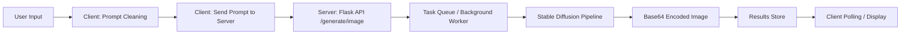
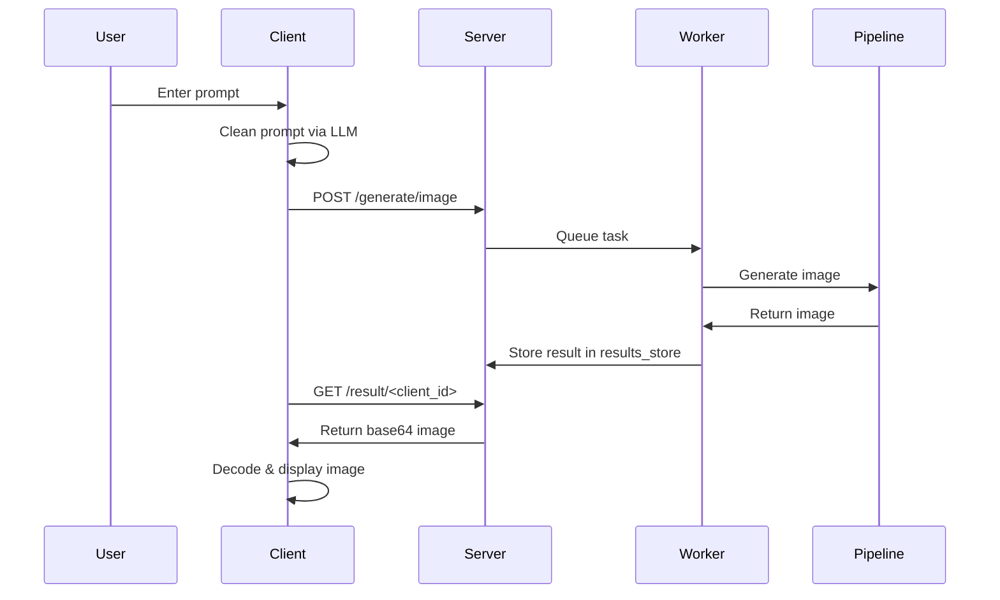

# AI Drawing Server & CLI Prompting client

## 🔹 Description
“This was created as a demonstration for the NTID ICS SVP orientation activity.”

This project demonstrates a **client-server architecture** for generating images from textual prompts using **Stable Diffusion** with a Flask backend. Users send prompts through a Python client, which cleans the prompt using an LLM (via Ollama) and then submits it to the server. The server processes the prompts asynchronously and returns images in base64 format.

This is create as a demonstration for NTID ICS SVP  orientation activity

Key features:

- Asynchronous image generation queue
- Prompt cleaning and grammar correction via LLM
- Real-time polling for generated images
- Client displays images using OpenCV
- Rich text output in the console

---

## 📦 Architecture

### Components Diagram



### Sequence Diagram



---

## 🚀 Getting Started

### Prerequisites

- Python 3.12+
- PyTorch with CUDA support if using GPU
- Stable Diffusion weights (stabilityai/stable-diffusion-xl-base-1.0)


### Installation

1. Clone the repository:

```bash
git clone <repository-url>
cd <repository-folder>
```

2. Install dependencies:
Cd into both the server and cli folders and run the pip install -r requirements
On the server, you will manually need to install pytorch with GPU support for your system

3. Start the server:

```bash
cd text2image
python text2imageServer.py
```

By default, the Flask server runs at `http://localhost:5000`.

---

## 🖌 Client Usage

1. Run the Python client:

```bash
cd text2ImageCLI
python text2imagecli.py
```

2. Enter your prompt:

```text
Enter your prompt (or 'exit' to quit): Lion running in a field
```

3. The client will:

- Clean the prompt via Ollama LLM
- Send the cleaned prompt to the server
- Poll for generated images
- Display the images in a window using OpenCV

4. To exit, type a prompt like "I am done" — the LLM will return `quit` automatically.

---

## ⚡ Server API

### POST `/generate/image`

Request JSON:

```json
{
  "prompt": "A lion in a field",
  "client_id": "uuid"
}
```

Response:

```json
{
  "status": "queued",
  "client_id": "uuid",
  "prompt": "A lion in a field"
}
```

### GET `/result/<client_id>`

Response JSON when image is ready:

```json
{
  "status": "done",
  "client_id": "uuid",
  "image_base64": "<base64 string>"
}
```

Response JSON when no task pending:

```json
{
  "status": "no task pending"
}
```

### GET `/processed-tasks-json`

Returns a list of processed tasks with prompts and base64 image strings.

---

## 📚 References

- [Stable Diffusion XL](https://huggingface.co/stabilityai/stable-diffusion-xl-base-1.0)
- [Flask Documentation](https://flask.palletsprojects.com/)
- [Diffusers Documentation](https://huggingface.co/docs/diffusers/index)
- [Ollama Python Client](https://ollama.com/docs/python)